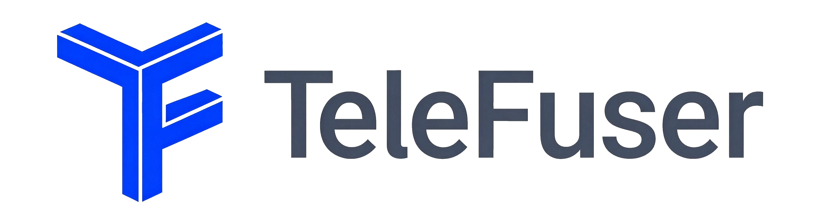

<div align="center">
  
</div>

<p align="center">
  中文 | <a href="README.md">English</a>
</p>

<p align="center">
  <a href="LICENSE"></a>
  
  
  
</p>

TeleFuser 是一个面向世界模型推理与多模态生成的高性能运行时框架。它重点服务于实时世界模型、语音驱动动画、流式视觉生成等连续、低时延、有状态的视觉生成任务。

## News 📰

- ✨ **2026-07-15**：新增 [**LingBot-World v2**](https://github.com/Robbyant/lingbot-world-v2) 支持，支持离线生成、交互式 WebRTC 流和多卡推理。

- ✨ **2026-07-06**：新增外部 **CacheSeek** latent cache 集成，支持服务模式下跨请求复用；命中后可跳过前 N 步去噪。Wan2.2 服务示例默认快照 `[5, 10, 15, 20, 25]`。配置和安装方式见 [docs/zh/latent_cache.md](docs/zh/latent_cache.md)。

## 为什么是 TeleFuser

大多数开源推理框架主要优化以下三类场景：

- 单次图像生成
- 离线视频生成
- 通用大语言模型服务

而实时世界模型需要的是另一种运行时能力：连续执行、流式输出、双向交互、会话状态保持、长上下文效率，以及并发场景下的稳定吞吐。TeleFuser 重点解决的正是这些问题。

在 TeleFuser 中，世界模型不只是“输入一次、返回一个视频”的函数，而是一个可以持续接收输入、保持状态、逐步产出结果的动态系统。

## TeleFuser 提供什么

- **面向世界模型的运行时**：支持连续视频生成、交互式会话和双向控制闭环。
- **ADF (AI Dev First)**：通过清晰的仓库分层、Pipeline Contract、示例和文档约束，让 AI Agent 能理解能力边界、遵循项目开发流程，并高效扩展 Pipeline。
- **异步 Pipeline 调度**：基于 Stage 的执行模型，支持请求隔离、资源锁和并行 Stage 组。
- **流式传输能力**：基于 WebRTC 的媒体流传输，并结合 DataChannel 实现实时控制。
- **可扩展 GPU 运行时**：支持多 GPU、张量并行、序列并行、Ray 部署和分布式工作节点编排。
- **推理优化栈**：包含 Triton Kernel、优化注意力后端、量化、卸载、特征缓存和 CacheSeek latent cache 集成。
- **统一服务方式**：既支持本地 Python 调用，也支持 `telefuser serve` 和 `telefuser stream-serve` 两种服务模式。

## 快速开始

### 安装

```bash
pip install -e .
```

开发环境安装：

```bash
pip install -e ".[dev]"
```

默认安装已通过 `aiortc` 包含 WebRTC 流式服务能力。

### 1. 批量视频推理

```python
from telefuser.pipelines.wan_video.wan21_video import Wan21VideoPipeline
import torch

pipe = Wan21VideoPipeline.from_pretrained(
    model_id_or_path="Wan-AI/Wan2.1-T2V-1.3B",
    device="cuda",
    torch_dtype=torch.bfloat16,
)

video = pipe(
    prompt="一只猫在弹钢琴",
    num_frames=81,
    height=480,
    width=832,
)
```

### 2. 实时世界模型 Demo

TeleFuser 当前提供了 `LingBot-World v2` 的双向 WebRTC Demo。
LingBot-World v2 使用相机控制和 v2 PPL 默认值；其流式示例将单个会话上限设为两分钟。


通过 VS Code Remote SSH 从笔记本浏览器访问时，coturn 是唯一需要额外安装的系统软件，不需要增加
Python 包。在 Debian 或 Ubuntu 上执行：

```bash
sudo apt-get update
sudo apt-get install -y coturn
```

该软件包同时提供 `turnserver` 和用于验证的 `turnutils_uclient`。如果这两个命令已经存在，或者浏览器
和 GPU 服务运行在同一台物理机器上，则可以跳过安装。

```bash
TF_MODEL_ZOO_PATH=/path/to/model_zoo \
CUDA_VISIBLE_DEVICES=0,1,2,3 \
TELEFUSER_TURN_SERVER='turn:127.0.0.1:3478?transport=tcp' \
TELEFUSER_TURN_USERNAME=telefuser \
TELEFUSER_TURN_CREDENTIAL=telefuser-turn \
telefuser stream-serve examples/lingbot/stream_lingbot_world_v2.py \
  --gpu-num 4 -p 8088 --host 0.0.0.0 --skip-validation

python examples/stream_server/webrtc_bidirectional_demo.py \
  --server-url http://127.0.0.1:8088 \
  --port 8091 \
  --image-path examples/data/lingbot_world_fast/image.jpg \
  --turn-url 'turn:localhost:3478?transport=tcp' \
  --turn-username telefuser --turn-credential telefuser-turn \
  --force-turn-relay --ice-gather-timeout-ms 30000 --no-open
```

该流程会启动一个持续运行的会话：客户端通过 WebRTC DataChannel 发送控制消息，服务端通过媒体轨道
持续回传生成视频。当浏览器运行在笔记本上，并通过 VS Code Remote SSH 访问远端服务器时，需要配置
TCP TURN，并转发 `8091` 和 `3478` 端口。由于 demo 会代理信令请求，因此不需要转发 `8088`。本地
`3478` 应保持映射到远端 `3478`；8091 可以映射到任意可用的本地端口。不使用 VS Code 时，可以在
笔记本终端中建立等效的 OpenSSH 隧道：

```bash
ssh -N -o ExitOnForwardFailure=yes -o ServerAliveInterval=30 \
  -L 8091:127.0.0.1:8091 \
  -L 3478:127.0.0.1:3478 \
  USER@SERVER_HOST
```

然后打开 `http://localhost:8091`。上面的 TURN 账号密码仅作为开发配置示例。coturn 启动方式、生产环境
注意事项及四张 H100 的实测配置见 [流服务文档](docs/zh/stream_server.md)
和 [LingBot example README](examples/lingbot/README.md)。

如果浏览器和 TeleFuser 服务运行在同一台物理机器上，则不需要 SSH 隧道或 TURN 服务。清除所有
`TELEFUSER_TURN_*` 环境变量，让服务监听 `127.0.0.1:8088`，启动 demo 时不要传入任何 `--turn-*`
或 `--force-turn-relay` 参数，然后打开 `http://localhost:8091`。如果只是通过 SSH 登录服务器、浏览器
仍然运行在笔记本上，则不属于本机访问，仍需使用上述端口转发和 TURN 配置。

### 3. 批处理服务模式

```bash
telefuser serve examples/wan_video/wan22_14b_text_to_video_h100.py --task t2v --port 8000
```

TeleFuser 对外提供：

- 原生任务接口 `/v1/tasks/*`
- OpenAI 兼容图像与视频接口 `/v1/images` 和 `/v1/videos`
- 基于 Pipeline Contract 自动生成的服务元数据

完整 API 说明见 [docs/zh/service.md](docs/zh/service.md)。

## 架构

TeleFuser 采用分层运行时架构，并与仓库目录结构保持一致：

1. **接入层**：FastAPI 任务接口与 WebRTC 流式入口。
2. **服务层**：请求路由、任务管理、流式会话、副本池，以及与 Pipeline 执行过程的集成。
3. **Pipeline 抽象层**：模型相关的 `BasePipeline` / `BaseStage` 组件；可选用 orchestrator 实现异步
   Stage 执行、请求状态跟踪和资源锁。
4. **模型与优化层**：模型加载、注意力选择、量化、offload、LoRA、cache 集成。
5. **执行后端层**：优化算子、Triton Kernel 和设备相关实现。

关键目录：

```text
telefuser/
├── service/         # REST API、流式 API、WebRTC 集成
├── orchestrator/    # Pipeline 编排
├── pipelines/       # 模型级 Pipeline 实现
├── distributed/     # TP / SP / FSDP / Ray 等并行能力
├── feature_cache/   # AdaTaylorCache
├── ops/             # 面向 compile 的算子分发层
├── kernel/triton/   # Triton Kernel
└── models/          # DiT、VAE、编码器、解码器
```

## 已支持 Pipeline

### 世界模型与实时生成导向

| Pipeline | 任务 | 说明 |
|----------|------|------|
| `LingBot-World v2` | 双向世界模型流式推理 | 交互式 WebRTC 控制闭环，见 [examples/lingbot/stream_lingbot_world_v2.py](examples/lingbot/stream_lingbot_world_v2.py) |
| `LiveAct` | S2V | 语音驱动数字人视频生成，见 [examples/liveact/liveact_s2v_h100.py](examples/liveact/liveact_s2v_h100.py) |
| `FlashVSR` | VSR | 流式视频超分，见 [examples/flashvsr/README.md](examples/flashvsr/README.md) |

### 视频生成

| Pipeline | 任务 | 说明 |
|----------|------|------|
| `WanVideo` (Wan2.1 / Wan2.2) | T2V, I2V, FL2V | 主力视频生成家族，含异步和服务示例，见 [examples/wan_video/README.md](examples/wan_video/README.md) |
| `HunyuanVideo` | T2V, I2V | 见 [examples/hunyuan_video/README.md](examples/hunyuan_video/README.md) |
| `LTX Video` | I2V + Audio | 统一音视频生成，见 [examples/ltx_video/README.md](examples/ltx_video/README.md) |
| `LongCat-Video` | T2V, I2V, VC | 长视频生成与续写，见 [examples/longcat_video/README.md](examples/longcat_video/README.md) |

### 图像与其他多模态生成

| Pipeline | 任务 | 说明 |
|----------|------|------|
| `Qwen-Image` | T2I, Edit | [examples/qwen_image/README.md](examples/qwen_image/README.md) |
| `Z-Image` | T2I | [examples/z_image/README.md](examples/z_image/README.md) |
| `Flux2 Klein` | T2I | [examples/flux2_klein/README.md](examples/flux2_klein/README.md) |

[examples/README.md](examples/README.md) 中提供了统一的 example runner 与 baseline 对比流程说明。

## 文档

- [docs/zh/service.md](docs/zh/service.md)：REST 服务、任务 API、OpenAI 兼容接口
- [docs/zh/stream_server.md](docs/zh/stream_server.md)：连续流式推理与 WebRTC 协议
- [docs/zh/parallel.md](docs/zh/parallel.md)：分布式推理架构
- [docs/zh/latent_cache.md](docs/zh/latent_cache.md)：CacheSeek latent cache 集成
- [docs/zh/feature_cache.md](docs/zh/feature_cache.md)：`AdaTaylorCache`
- [docs/zh/model_loading.md](docs/zh/model_loading.md)：模型加载方式
- [docs/zh/attention.md](docs/zh/attention.md)：注意力后端与配置
- [docs/zh/torch_compile_compatibility.md](docs/zh/torch_compile_compatibility.md)：`torch.compile` 相关约束
- [docs/zh/adding_new_model.md](docs/zh/adding_new_model.md)：新模型接入
- [docs/zh/adding_new_example.md](docs/zh/adding_new_example.md)：Example 与 Pipeline Contract 编写方式

## 已知限制

- `AdaTaylorCache` 目前只对部分模型家族提供了校准参数。
- `torch.compile` 在部分路径上仍处于实验阶段。
- 一些优化能力依赖特定 GPU 架构和 CUDA 环境。
- `LingBot-World v2` 这类世界模型示例依赖外部权重和额外环境配置。
- 多机部署在架构上已有支持，但实际落地通常还需要项目级集成与验证。

## 开发

```bash
pip install -e ".[dev]"
pre-commit install
pytest tests/
```

贡献流程见 [CONTRIBUTING.md](CONTRIBUTING.md)，项目内 Agent 约束见 [AGENTS.md](AGENTS.md)。

## 许可证

Apache 2.0，详见 [LICENSE](LICENSE)。

## 致谢

TeleFuser 建立在多模态生成与推理系统相关的开源工作之上，也受到了这些项目的启发，包括：

- [DiffSynth-Studio](https://github.com/modelscope/DiffSynth-Studio)
- [DiffSynth-Engine](https://github.com/modelscope/DiffSynth-Engine)
- [LightX2V](https://github.com/ModelTC/LightX2V)
- [cache-dit](https://github.com/vipshop/cache-dit)
- [diffusers](https://github.com/huggingface/diffusers)
- [Wan2.1](https://github.com/Wan-Video/Wan2.1) / [Wan2.2](https://github.com/Wan-Video/Wan2.2)
- [Qwen-Image](https://github.com/QwenLM/Qwen-Image)
- [Z-Image](https://github.com/Tongyi-MAI/Z-Image)
- [FlashVSR](https://github.com/OpenImagingLab/FlashVSR)
