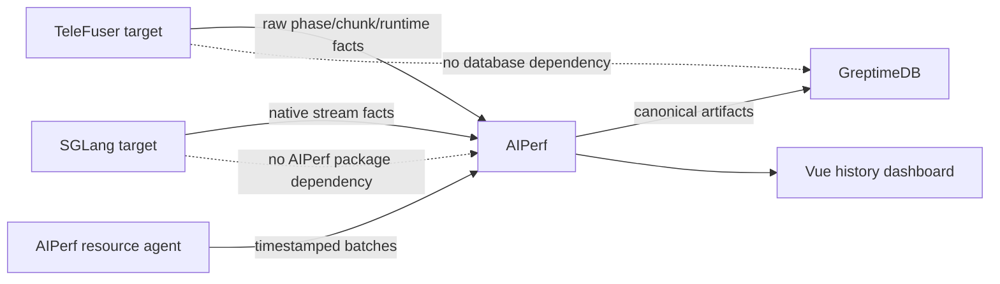

# TeleFuser 与 AIPerf Benchmark 设计

本文定义稳定的职责、协议和指标语义。具体实验数值、机器地址和运行状态不属于设计文档，应保存在
GreptimeDB 与可重放产物中。

## 1. 目标与非目标

设计目标：

- 同一 workload 可以比较 TeleFuser、SGLang-Diffusion 和后续实现；
- 客户端交付性能、目标侧计算性能和资源使用互不混淆；
- Batch 与 Stream 共用产物、历史查询和展示维度；
- target 只上报原始、有限、有时间戳的事实；
- AIPerf 统一负责采集生命周期、warmup、聚合、映射、存储和界面。

非目标：

- 不在 TeleFuser 内复制 AIPerf、GreptimeDB client 或历史前端；
- 不用 mock、offload 或 fallback 结果替代正式 GPU-resident 结果；
- 不把实现私有字段全部提升为用户可选的顶层指标。

## 2. 仓库与依赖边界



| 组件 | 归属 | 职责 |
|---|---|---|
| TeleFuser runtime | TeleFuser | 同步测量 target phase/chunk，暴露环境与 cache 原始事实 |
| Target adapter | AIPerf | 将 HTTP、WebRTC、WebSocket 等 wire event 转成统一 session timeline |
| 聚合与语义映射 | AIPerf | warmup、percentile、weighted FPS、canonical metric |
| Resource agent | AIPerf | 采样目标进程树、cgroup、机器和设备资源并主动上报 |
| History API/UI | AIPerf | GreptimeDB schema、查询、左右 Run 对比和图表 |
| Contract/config/data | Target 仓库 | 固定 target 能力、workload 和可复现入口 |

`benchmarks/aiperf/` 是被 Git 忽略的固定外部 checkout。`scripts/setup_aiperf_repo.sh` 与 benchmark launcher
不接受路径覆盖，AIPerf 必须位于 `<TeleFuser>/benchmarks/aiperf`。repo URL、branch 和 ref 可以调整，正式运行
仍必须固定 commit，不能只记录可移动分支名。

## 3. 场景与实现

| 场景 | TeleFuser | Baseline | 公平性边界 |
|---|---|---|---|
| Batch Video | OpenAI 兼容 `/v1/videos` | 兼容相同 contract 的外部 target | prompt、输入图、尺寸、帧数、steps、seed 一致 |
| Stream World | WebRTC media + DataChannel | SGLang WebSocket + MessagePack | prompt、首帧、FPS、session、control trace、GPU/offload 策略一致 |
| Transport Mock | WebRTC mock | WebSocket mock | 只比较 transport/harness，不解释模型性能 |

Transport 可以不同，但 adapter 输出的逻辑事件必须一致：连接、首帧、控制发送、控制确认、下一帧、chunk
事实和 session 结束。

## 4. Target 原始事实协议

### 4.1 通用规则

- duration 使用单调时钟；跨进程/跨机器样本同时携带源端 UTC 时间戳；
- CUDA phase 在开始和结束边界同步目标设备；
- 数值必须有限且非负，不可用字段省略或为 `null`，不能伪造为零；
- memory 使用 bytes 作为线协议单位；显示层再转换为 MB/GB；
- target 不排除 warmup、不计算 percentile、不生成跨 Run 结论。

### 4.2 Phase fact

```json
{
  "name": "pipeline_init",
  "seconds": 12.3,
  "memory": [
    {
      "device": "cuda:0",
      "peak_allocated_bytes": 123,
      "peak_reserved_bytes": 456
    }
  ]
}
```

TeleFuser Stream metadata 可以提供 `pipeline_init`；首次 LingBot chunk 之前提供 `runtime_creation`。

### 4.3 Chunk fact

```json
{
  "index": 3,
  "frames": 3,
  "compute_seconds": 0.45,
  "memory": []
}
```

TeleFuser 的 `compute_seconds` 从 chunk 提交 actor graph 前开始，覆盖 encode、denoise、decode 与目标内调度，
结束于原始帧返回。`encode_seconds` 是 AIPerf 支持的可选事实，仅在 target 能给出有界 payload 编码阶段时
上报；当前 TeleFuser 原生 WebRTC 编码发生在 chunk fact 之后，因此省略该字段。客户端网络接收、播放 pacing
和 UI 渲染不进入 target compute。当前 LingBot 生成位于子 actor 中，服务进程的 CUDA allocator 统计不能覆盖
完整 actor graph，因此 `memory` 保持为空；进程树显存时序由 AIPerf resource telemetry 采集，不能拿它替代
reset-scoped allocator peak。

### 4.4 Runtime fact

LingBot runtime 只上报稳定几何信息：

- width、height、latent frames 和 frame tokens；
- chunk size 与 max attention size；
- local attention、sink 和 KV cache capacity。

软件环境至少包含 TeleFuser commit、Python、PyTorch、CUDA 以及可见 GPU 型号、compute capability 和显存容量。

## 5. AIPerf 聚合语义

### 5.1 Scope

| Scope | 示例 | 聚合规则 |
|---|---|---|
| Event | control ack、frame arrival | 保留单事件时间线 |
| Chunk | `chunk_compute_fps` | `frames / compute_seconds` |
| Session | `stream_fps`、first-frame latency | 每个 session 独立计算 |
| Run | `chunk_compute_fps_weighted` | warmup 后 `sum(frames) / sum(compute_seconds)` |

`stream_fps`、`chunk_compute_fps` 和 `chunk_compute_fps_weighted` 不得合并。avg、P95、P99 是同一个 canonical
指标的统计曲线，不是三项独立指标。

### 5.2 五个核心维度

| 维度 | Canonical leaf 示例 |
|---|---|
| 交付 | success rate、frames received、stream FPS |
| 时延 | request、first frame、control ack、control-to-frame |
| 吞吐 | request throughput、weighted compute FPS |
| 目标执行 | pipeline/runtime phase、chunk compute、可选 encode、allocator peak |
| 资源 | CPU、内存、GPU、显存、网络 |

TeleFuser 与 SGLang 的私有字段先保存为 raw point，再由版本化 mapping 映射到这些 leaf。无法等价的字段保持
私有或 unavailable，不通过改名制造可比性。

## 6. 主动资源上报

Resource agent 与 target PID 同机运行：

1. 注册 run 与 source identity；
2. 每 1 秒采样；
3. 每 15 秒有界批量上报；
4. 任务完成、失败或取消时立即 final flush；
5. 注册、批次或 final flush 未获确认时使启用资源采集的 benchmark 失败。

每个点包含 `run_id`、metric、subject、source timestamp、value、unit 和区分设备/网卡/cgroup 的 labels。

资源 subject：

- `process_used`：目标 PID 及其后代；
- `container_used`：能可靠解析的 cgroup charged usage；
- `machine_used`：整机或物理设备使用；
- `machine_total`：整机/设备容量；
- `container_total`：有限容器上限，仅作为容量事实。

采集规则：

- CPU 以一个逻辑核为 100%，多核进程和整机允许超过 100%；
- GPU/显存按物理设备保留 labels，同一 Run、同一 subject 内才允许堆叠；
- Ethernet 使用网卡 byte counter；RDMA 使用 active-port counter；
- 机器网络 counter 不能可靠归因到进程，因此不伪造 `process_used`；
- cgroup v1/v2 无法解析的上限保持 unavailable，不拿整机容量替代；
- 通用 cgroup 没有可移植网络带宽上限，因此不生成容器网络容量。

## 7. GreptimeDB 与前端

GreptimeDB 是 History 的唯一在线存储。服务启动或建表失败直接失败，查询失败返回 503；不存在 SQLite、
内存索引或文件直查 fallback。JSON/JSONL 是可重放导入源，不是在线查询后端。

部署时由 TeleFuser setup 在固定 `benchmarks/aiperf` checkout 内创建独立的无 dev 依赖运行环境，并创建
固定 `artifacts` 导入根目录；Vue 构建产物随 AIPerf 提供，API 与前端由同一 History 进程服务，不引入
第二个 Node.js 运行进程。GreptimeDB 使用独立持久化卷，开发机默认只监听 loopback；远端查看通过 SSH
tunnel 或带认证的反向代理完成。

前端使用与指标树相同的五维顺序：

- 左侧固定树只列 canonical leaf；
- TeleFuser/SGLang 和 avg/P95/P99 作为图中曲线，不拆成树节点；
- 右侧支持左右两组 Run，并按固定维度和 leaf 顺序排列卡片；
- 勾选只控制整项指标的显示/隐藏，不改变卡片顺序；
- 百分比用量允许堆叠，容量使用独立单线小图；
- 连续折线节点只在悬浮时显示；tooltip 位于浏览器 top layer，不能被卡片裁剪；
- 内存、显存和带宽按量级显示 KB/MB/GB/TB 与 KB/s/MB/s/GB/s/TB/s。

## 8. 产物与失败语义

每个 Run 至少保留：

- resolved config、contract 和 AIPerf commit；
- summary、session/event JSONL 和 normalized points；
- target metadata 与资源 source identity；
- 成功、失败、超时、OOM 和取消数量；
- 独立 HTML 报告。

正式对比只使用 workload 与资源策略一致的成功 Run。OOM、超时和连接失败本身也是结果，不从分母删除；
mock、native fallback 或 offload Run 必须使用不同 qualification，不能伪装成正式配置。

## 9. 验证要求

提交前至少覆盖：

- runtime timer、设备去重、finite value 与 allocator fact 单元测试；
- TeleFuser phase/chunk event 及 API 指标透传；
- TeleFuser WebRTC 与 SGLang WebSocket mock contract；
- warmup 排除、weighted FPS 和 canonical mapping；
- resource schema、cgroup、Ethernet/RDMA 与 final flush；
- GreptimeDB 强依赖、幂等导入、API 查询和 Vue production build；
- 一次固定配置的真实 TeleFuser Run；SGLang 公平配置无法完成时保留明确失败证据。
